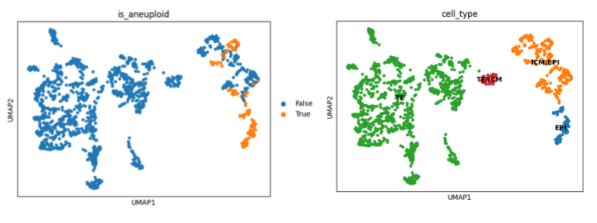

# Aneuploidy Impacts on Early Human Embryonic Cells

## Overview
This project investigates how aneuploidy,the presence of an abnormal number of chromosomes, affects the transcriptional identity and functional state of early human embryonic cells. Using single-cell RNA sequencing (scRNA-seq) data from preimplantation embryos (E3–E7), we compare aneuploid and euploid cells to uncover changes in gene expression, enriched biological pathways, and disrupted cellular processes.

## Key Analyses
- **Data Exploration** initial look at data
- **QC and Preprocessing** clean and normalize data
- **Karyotype Inference** infer cnv and classify cells as aneuploid or euploid
- **Clustering and Cluster Annotation** cluster and annotate clusters
- **Differential expression analysis** between aneuploid and euploid cells  
- **Gene ontology enrichment** to identify disrupted biological functions  

## Findings
Results reveal that aneuploid cells often:
- Show Epigenetic Dysregulation  
- Exhibit Impaired Developmental Signaling & Cell Differentiation  
- Have Impaired Cell-Cell Communication & Extracellular Signaling  

These transcriptional disruptions likely explain the **low developmental viability** of aneuploid embryos.

## Results Overview

Below are some representative visualizations from the analysis.

*Figure 1: UMAP projections showing (left) aneuploid vs. euploid classification and (right) inferred cell type identities.*

*Figure 2: PAGA graph illustrating developmental trajectories between cell types (left) and the distribution of aneuploidy across the trajectory (right).*

  
*Figure 3: Top-ranked differentially expressed genes between aneuploid and euploid cells.*

## Author
*William Mwine*
